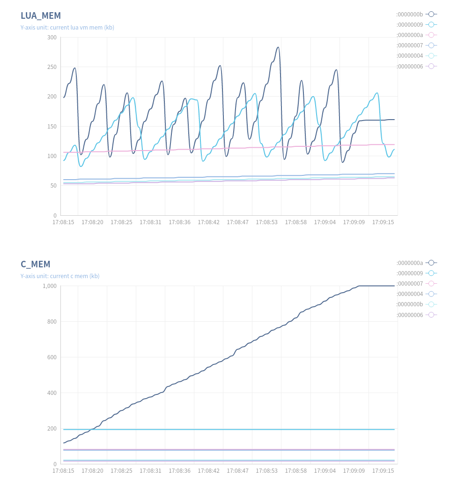
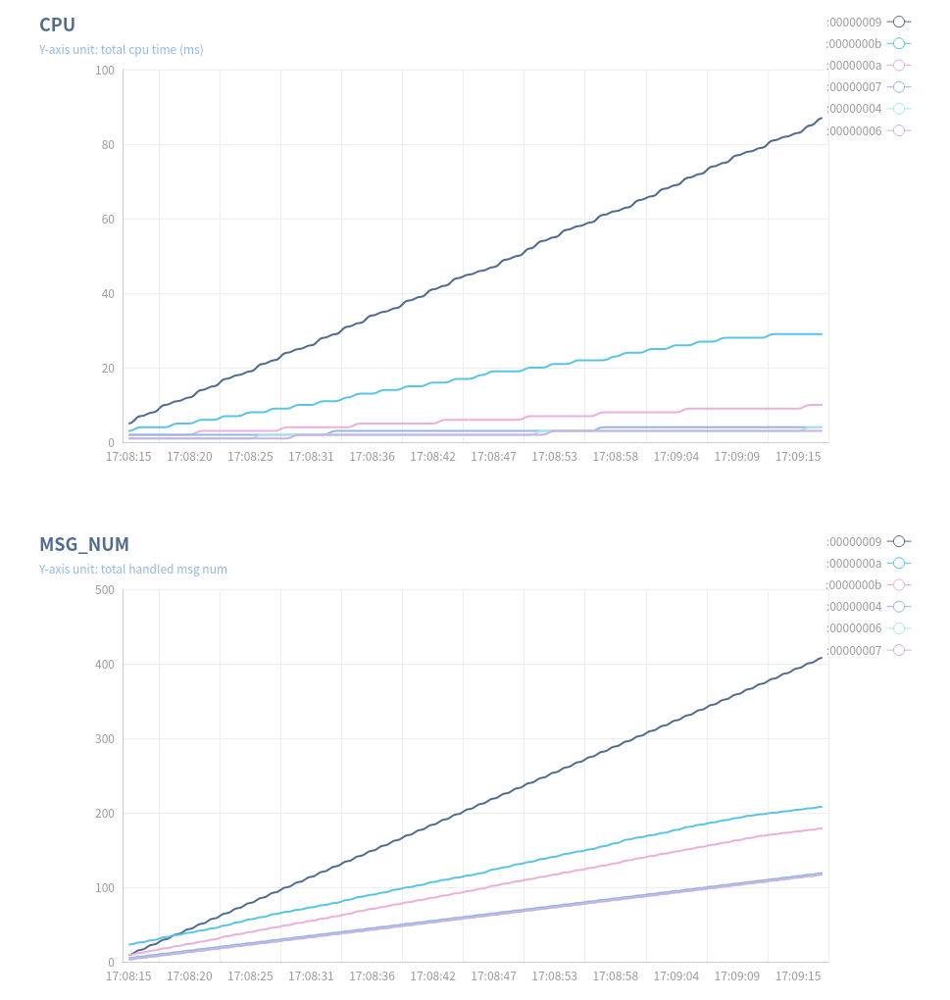

# Skynet-observer
a web graphical tool for observing the debug console sampling data in skynet
* What is skynet? https://github.com/cloudwu/skynet

## 编译 && 运行示例
* 将编译后的skynet仓库连接到工程目录下
```bash
# ln -sf $YOUR_SKYNET_PATH skynet
```
* 编译采集器skynet-observer
```bash
# go build
```
* 运行测试用例
```bash
# ./skynet/skynet test/config
```
* 启动采集器
```bash
# ./skynet-observer -rmt 127.0.0.1:8031
```
* 开始采集
```bash
# 浏览器访问 http://127.0.0.1:3000/start
```
* 结束采集
```bash
# 浏览器访问 http://127.0.0.1:3000/stop
```

## 采样结果示例
```bash
# -----top 10 services list, merge(6)-----
# :00000004 => snlua cdummy (LUA_MEM:<5>st C_MEM:<4>st CPU:<5>st MSG_NUM:<4>st MQ_LEN:<1>st )
# :00000006 => snlua datacenterd (LUA_MEM:<6>st C_MEM:<6>st CPU:<6>st MSG_NUM:<6>st MQ_LEN:<2>st )
# :00000007 => snlua service_mgr (LUA_MEM:<4>st C_MEM:<3>st CPU:<4>st MSG_NUM:<5>st MQ_LEN:<3>st )
# :00000009 => snlua debug_console 0.0.0.0 8031 (LUA_MEM:<2>st C_MEM:<2>st CPU:<1>st MSG_NUM:<1>st MQ_LEN:<4>st )
# :0000000a => snlua test_gate (LUA_MEM:<3>st C_MEM:<1>st CPU:<3>st MSG_NUM:<2>st MQ_LEN:<5>st )
# :0000000b => snlua test_client (LUA_MEM:<1>st C_MEM:<5>st CPU:<2>st MSG_NUM:<3>st MQ_LEN:<6>st )
```



## 其他扩展库
* https://github.com/xingshuo/skynet-ext
* https://github.com/xingshuo/skynet-perf
* https://github.com/xingshuo/skynet-mprof